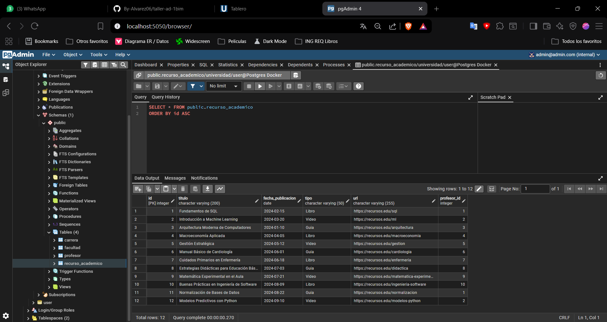

# Evidencias

## MariaDB

### Creación y subida de BD MariaDB

### Consultas

**Consulta 1 - session.query().all**

**Consulta 2-4 | session.query(and_(), or_()) | session.query().filter()**

**Consulta 5 | session.query().order_by()**

## Postgres

### Creación y subida de BD
Para realizarlo, entramos al pgAdmin 4 (interfaz gráfica de Postgres) y creamos un nuevo server
**Configurar la pestaña "Connection" (Lo más importante)**
Cambia a la pestaña Connection en la parte superior y llena los datos exactamente así:

- Host name/address: Escribe postgres (Este es el nombre del servicio en tu docker-compose. Así es como pgAdmin encuentra al otro contenedor dentro de la red de Docker).
- Port: Escribe 5432 (Es el puerto interno original de Postgres, no el 5434 que usamos afuera).
- Maintenance database: Dejarlo en postgres.
- Username: Escribe user (Sacado de POSTGRES_USER).
- Password: Escribe password (Sacado de POSTGRES_PASSWORD).

